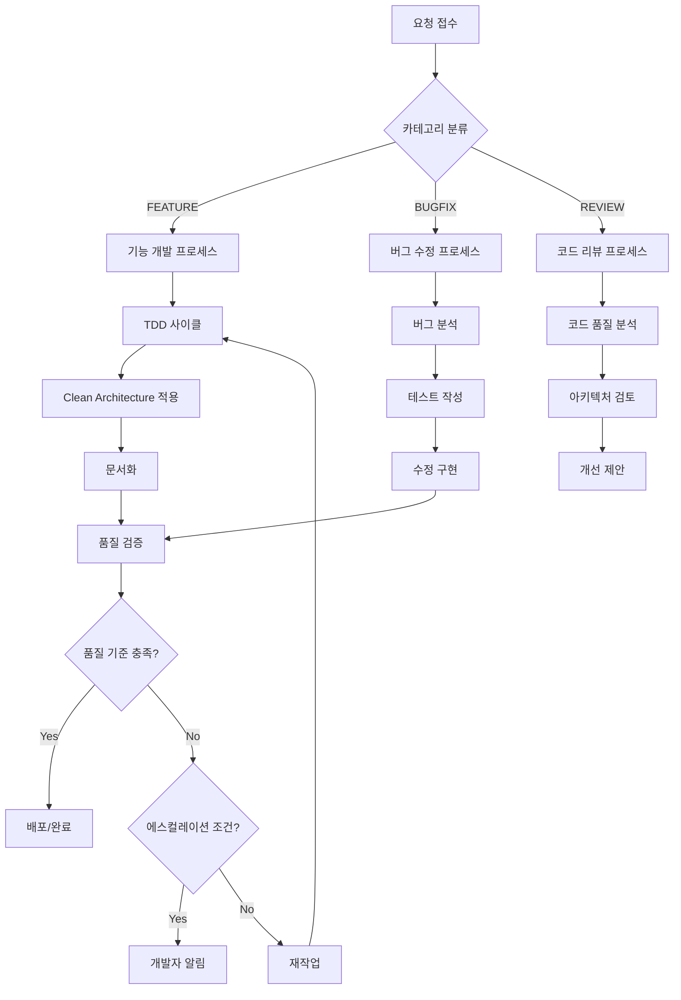

# Agent Assist Prompt

AI를 활용한 체계적이고 전문적인 소프트웨어 개발 프로세스 가이드

## 📋 개요

이 프로젝트는 인공지능을 활용하여 소프트웨어 개발의 전체 과정을 체계화하고 자동화하는 포괄적인 프롬프트 시스템입니다. TDD, Clean Architecture, 코드 품질 관리, 자동화된 문서화, 그리고 효율적인 에스컬레이션 시스템을 포함합니다.

## 🎯 주요 목표

- **품질 보장**: 테스트 커버리지 80% 이상, Clean Architecture 준수
- **자동화**: 문서 생성, 코드 리뷰, 성능 테스트 자동화
- **투명성**: 모든 개발 과정의 체계적 문서화
- **효율성**: 반복 작업 최소화 및 에스컬레이션 시스템

## 📁 파일 구조

```
Agent_Assist_Prompt/
├── README.md                           # 프로젝트 개요 (이 파일)
├── AI_Development_Process.md           # 전체 개발 프로세스 문서
├── AI_Development_Prompt.md            # AI에게 제공할 핵심 프롬프트
├── AI_Templates_and_Checklists.md     # 실무 템플릿 및 체크리스트
└── Quick_Start_Guide.md               # 빠른 시작 가이드
```

## 🚀 빠른 시작

### 1. AI 프롬프트 활용
`AI_Development_Prompt.md`의 내용을 AI에게 제공하여 체계적인 개발 프로세스를 시작하세요.

### 2. 작업 카테고리 선택
```
[FEATURE] - 새로운 기능 개발
[BUGFIX]  - 버그 수정
[REVIEW]  - 코드 검토
```

### 3. 템플릿 활용
`AI_Templates_and_Checklists.md`에서 상황에 맞는 템플릿을 선택하여 사용하세요.

## 🔧 주요 기능

### 1. TDD 기반 개발 프로세스
- Red-Green-Refactor 사이클 자동화
- 테스트 커버리지 80% 이상 보장
- 자동화된 테스트 리포트 생성

### 2. Clean Architecture 적용
- 계층 분리 및 의존성 역전 원칙
- SOLID 원칙 자동 검증
- 아키텍처 문서 자동 생성

### 3. 자동화된 문서화
- 기능 명세서 자동 생성
- API 문서 자동 업데이트
- 코드 리뷰 보고서 생성

### 4. 품질 관리
- 코드 커버리지 실시간 모니터링
- 정적 분석 및 보안 검사
- 성능 테스트 자동화

### 5. 에스컬레이션 시스템
- 문제 발생 시 자동 감지
- Slack 연동 알림 시스템
- 개발자 개입 조건 자동 판단

### 6. Git 워크플로우 관리
- 브랜치 전략 자동화
- Conventional Commits 준수
- PR/MR 템플릿 제공

## 📊 프로세스 플로우



## 🛠️ 사용 방법

### 기본 사용법

1. **AI에게 프롬프트 제공**
   ```
   AI_Development_Prompt.md의 내용을 복사하여 AI에게 제공
   ```

2. **작업 요청**
   ```
   "[FEATURE] 사용자 인증 시스템 구현"
   "[BUGFIX] 로그인 오류 수정 #123"
   "[REVIEW] /src/auth/ 디렉토리 코드 검토"
   ```

3. **진행 상황 모니터링**
   - 생성된 문서들을 통해 진행 상황 확인
   - 코드 커버리지 및 품질 지표 모니터링
   - 에스컬레이션 알림 확인

### 고급 사용법

#### CLI 통합 (예시)
```bash
# 기능 개발
ai-dev feature "OAuth 로그인" --tdd --coverage 85

# 버그 수정
ai-dev bugfix "세션 만료 오류" --issue 456 --priority high

# 성능 테스트
ai-dev perf-test --endpoint /api/auth --load 1000
```

#### Slack 연동 설정
```bash
# Webhook URL 설정
export SLACK_WEBHOOK_URL="https://hooks.slack.com/services/..."

# 알림 테스트
./scripts/slack_notify.sh "Test Project" "Feature" "Medium" "테스트 메시지"
```

## 📈 품질 지표

### 필수 품질 게이트
- ✅ 테스트 커버리지 80% 이상
- ✅ 모든 테스트 통과
- ✅ Clean Architecture 원칙 준수
- ✅ 보안 취약점 없음
- ✅ 성능 기준 충족

### KPI 측정
- 개발 완료 시간
- 버그 발생률
- 코드 품질 점수
- 문서화 완성도

## 🔄 에스컬레이션 시나리오

### 자동 에스컬레이션 조건
1. **즉시 알림**: 보안 취약점, 데이터 손실 위험
2. **24시간 내**: 동일 문제 3회 반복, 커버리지 미달
3. **48시간 내**: 일정 지연 30% 초과, 기술적 의사결정 필요

### Slack 알림 예시
```
🚨 AI 개발 에스컬레이션

프로젝트: MyApp
작업: 사용자 인증 기능
문제: 테스트 커버리지 목표 미달 (현재: 65%, 목표: 80%)
발생횟수: 3회
긴급도: Medium

시도한 해결방안:
1. 추가 유닛 테스트 작성
2. 통합 테스트 보강
3. E2E 테스트 추가

추천 해결방안: 복잡한 비즈니스 로직 분리 후 테스트 작성
```

## 🤝 기여 방법

1. Fork this repository
2. Create your feature branch (`git checkout -b feature/AmazingFeature`)
3. Follow the development process outlined in `AI_Development_Prompt.md`
4. Commit your changes (`git commit -m 'feat: Add amazing feature'`)
5. Push to the branch (`git push origin feature/AmazingFeature`)
6. Open a Pull Request

## 📄 라이선스

This project is licensed under the MIT License - see the [LICENSE](LICENSE) file for details.

## 🙏 감사의 말

이 프로젝트는 AI와 인간 개발자의 협업을 통해 더 나은 소프트웨어 개발 문화를 만들어가는 것을 목표로 합니다. 여러분의 피드백과 기여를 환영합니다.

## 📞 문의

- 이슈 리포트: [GitHub Issues](https://github.com/your-repo/issues)
- 기능 제안: [GitHub Discussions](https://github.com/your-repo/discussions)
- 문의 사항: [이메일](mailto:your-email@example.com)

---

**Happy Coding with AI! 🚀**