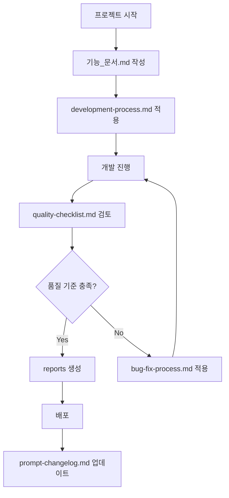

# 📚 AI 개발 프로세스 문서 구조

> **모듈화된 AI 개발 가이드**  
> 각 프로젝트에서 재사용 가능한 체계적인 개발 문서 모음

## 🏗️ 문서 구조

```
docs_example/
├── README.md                    # 📖 전체 가이드 (이 파일)
├── 기능_문서.md                 # 🎯 기능 명세 및 요구사항
├── 프로젝트_소개.md             # 🚀 프로젝트 개요 및 목표
├── reports/                     # 📊 결과 보고서
│   ├── ci-cd-report.md         # CI/CD 파이프라인 결과
│   ├── coverage-report.md      # 코드 커버리지 리포트
│   └── performance-report.md   # 기능 효율성 분석
├── guides/                      # 📋 개발 가이드
│   ├── development-guide.md    # 개발 방법
│   ├── build-guide.md          # 빌드 방법
│   └── deployment-guide.md     # 배포 방법
├── adr/                        # 🏛️ Architecture Decision Records
│   ├── README.md              # ADR 가이드
│   └── adr-template.md        # ADR 템플릿
├── development/                # 💻 개발 프로세스
│   ├── development-process.md  # 개발 방법론
│   ├── coding-standards.md    # 개발 규칙
│   └── bug-fix-process.md     # 버그 개선 프로세스
├── review/                     # 🔍 코드 검토
│   ├── quality-checklist.md   # 품질 관리 체크리스트
│   └── review-process.md      # 검토 프로세스
└── prompt-management/          # 🤖 AI 프롬프트 관리
    ├── prompt-changelog.md     # 프롬프트 변경사항
    └── prompt-templates.md     # 프롬프트 템플릿
```

## 🎯 사용 목적

### 🔄 프로젝트별 재사용
각 문서는 독립적으로 설계되어 다양한 프로젝트에서 복사하여 사용할 수 있습니다.

### 👥 팀 협업 강화
체계적인 문서 구조로 팀원들 간의 이해도와 협업 효율성을 높입니다.

### 🤖 AI 어시스턴트 최적화
각 문서가 특정 목적에 맞게 모듈화되어 AI에게 명확한 지침을 제공합니다.

## 🚀 빠른 시작

### 1. 새 프로젝트 시작
```bash
# 1. docs_example 폴더를 새 프로젝트에 복사
cp -r docs_example my-new-project/docs

# 2. 프로젝트에 맞게 문서 커스터마이징
cd my-new-project/docs
```

### 2. AI와 협업 시작
```
1. development/development-process.md → AI에게 개발 프로세스 제공
2. review/quality-checklist.md → 품질 검토 기준 제공
3. prompt-management/prompt-templates.md → 상황별 프롬프트 활용
```

### 3. 품질 관리 프로세스
```
📊 기능 품질 관리 4단계:
└── 사용자 입장 → 일반화 → 한계점 → 문제 대처
```

## 📋 품질 관리 체계

### 🎯 1단계: 사용자 입장
- **사용성**: 기능이 실제로 유용한가?
- **명확성**: 사용자가 이해하기 쉬운 명칭인가?
- **직관성**: 사용 방법이 직관적인가?
- **권한**: 필요한 권한이 적절히 부여되었는가?

### 🔧 2단계: 일반화
- **요구사항 준수**: 모든 요구사항이 구현되었는가?
- **지연성 고려**: Lazy Loading, Observer 패턴 등이 적용되었는가?
- **기준정보**: 표준 및 기준이 명확히 정의되었는가?
- **권한 신뢰 인증**: 보안 요소가 충분히 고려되었는가?
- **성능 확인**: 성능 요구사항을 만족하는가?

### ⚠️ 3단계: 한계점
- **안정성 & 효율성**: Stress Test 결과가 만족스러운가?
- **개발 환경**: 다양한 환경에서 정상 동작하는가?
- **기능 제한**: 알려진 제한사항이 문서화되었는가?

### 🚨 4단계: 문제 대처
- **개발자 요청**: 문제 발생 시 언제 에스컬레이션할 것인가?
- **해결 방안**: 단계별 문제 해결 프로세스가 있는가?

## 📖 문서별 사용 가이드

### 🎯 기능 개발 시
1. [`기능_문서.md`](./기능_문서.md) - 요구사항 정의
2. [`development/development-process.md`](./development/development-process.md) - 개발 진행
3. [`review/quality-checklist.md`](./review/quality-checklist.md) - 품질 검토

### 🐛 버그 수정 시
1. [`development/bug-fix-process.md`](./development/bug-fix-process.md) - 버그 분석 및 수정
2. [`review/review-process.md`](./review/review-process.md) - 수정 사항 검토

### 🏗️ 아키텍처 결정 시
1. [`adr/adr-template.md`](./adr/adr-template.md) - 의사결정 기록
2. [`프로젝트_소개.md`](./프로젝트_소개.md) - 프로젝트 업데이트

### 📊 성과 분석 시
1. [`reports/`](./reports/) - 각종 보고서 활용
2. [`prompt-management/prompt-changelog.md`](./prompt-management/prompt-changelog.md) - AI 성능 분석

## 🔄 워크플로우


---

**💡 TIP**: 각 문서는 독립적으로 사용 가능하니, 필요한 부분만 선택해서 활용하세요! 