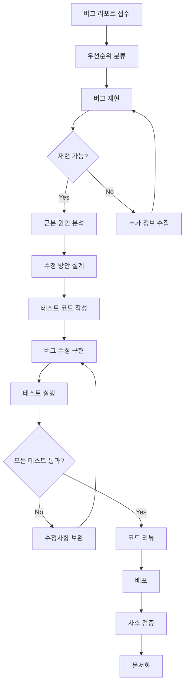

# 🐛 버그 수정 프로세스

> **체계적이고 효율적인 버그 해결 방법론**  
> 버그 발견부터 배포까지의 전체 프로세스

## 🎯 목적

### 버그 수정 프로세스의 중요성
- **신속한 대응**: 빠른 문제 해결로 서비스 안정성 확보
- **재발 방지**: 근본 원인 분석을 통한 항구적 해결
- **품질 향상**: 체계적 접근으로 전반적인 코드 품질 개선
- **학습 효과**: 팀 전체의 디버깅 역량 강화

---

## 🔄 버그 수정 워크플로우



---

## 📋 1단계: 버그 리포트 접수

### 🎯 버그 분류 기준

#### 심각도 (Severity)
```
Critical (S1): 시스템 다운, 데이터 손실, 보안 취약점
- 즉시 대응 (30분 이내)
- 24시간 내 수정 완료
- 전체 팀 투입

High (S2): 주요 기능 장애, 많은 사용자 영향
- 2시간 이내 대응
- 72시간 내 수정 완료
- 시니어 개발자 투입

Medium (S3): 일반적인 기능 문제, 일부 사용자 영향
- 1일 이내 대응
- 1주일 내 수정 완료
- 담당 개발자 배정

Low (S4): 사소한 문제, 워크어라운드 존재
- 1주일 이내 대응
- 다음 스프린트에서 수정
- 백로그 추가
```

#### 우선순위 (Priority)
```
P1: 비즈니스에 치명적 영향
P2: 중요한 기능에 영향
P3: 일반적인 우선순위
P4: 개선사항 수준
```

### 📝 버그 리포트 템플릿
```markdown
## 🐛 버그 리포트

### 기본 정보
- **이슈 번호**: BUG-YYYY-XXXX
- **리포터**: [이름]
- **발견일**: [YYYY-MM-DD]
- **심각도**: [Critical/High/Medium/Low]
- **우선순위**: [P1/P2/P3/P4]
- **영향 범위**: [시스템/모듈/기능]

### 환경 정보
- **OS**: [Windows 10/macOS/Linux]
- **브라우저**: [Chrome 95/Firefox 93/Safari 15]
- **애플리케이션 버전**: [v1.2.3]
- **데이터베이스**: [PostgreSQL 13.x]

### 버그 설명
[버그에 대한 명확하고 구체적인 설명]

### 재현 단계
1. [첫 번째 단계]
2. [두 번째 단계]
3. [세 번째 단계]

### 예상 결과
[정상적으로 동작했을 때의 기대 결과]

### 실제 결과
[실제로 발생한 문제 상황]

### 추가 정보
- **스크린샷**: [첨부 파일]
- **로그 파일**: [관련 로그]
- **에러 메시지**: [정확한 에러 내용]

### 임시 해결책
[현재 사용 중인 워크어라운드가 있다면]
```

---

## 🔍 2단계: 버그 재현

### 🎯 재현 환경 구성
```bash
# 1. 버그 재현 환경 설정
git checkout [버그-발생-버전]
npm install
npm run setup:test-env

# 2. 데이터베이스 상태 복원
pg_restore --dbname=test_db backup_when_bug_occurred.sql

# 3. 외부 의존성 모킹
docker-compose up -d mock-services
```

### 📋 재현 체크리스트
```
□ 정확한 버전에서 재현 시도
□ 동일한 환경 조건 설정
□ 사용자 데이터 상태 복원
□ 네트워크 상태 고려
□ 동시성 조건 확인
□ 브라우저별 차이 검증
□ 모바일/데스크톱 환경 구분
```

### 🧪 재현 테스트 코드 작성
```typescript
// 버그 재현 테스트 - 반드시 실패해야 함
describe('Bug BUG-2024-0123: Login session expires immediately', () => {
  beforeEach(() => {
    // 버그 발생 조건 설정
    mockSystemTime('2024-01-23T10:00:00Z');
    setupUserSession({ 
      userId: 'test-user',
      loginTime: '2024-01-23T09:30:00Z' 
    });
  });

  it('should maintain session for 30 minutes but currently expires immediately', async () => {
    // Given: 사용자가 로그인한 상태
    const loginResponse = await login('test@example.com', 'password');
    expect(loginResponse.sessionToken).toBeDefined();
    
    // When: 30분 후 API 호출
    advanceTimeBy(30 * 60 * 1000); // 30분
    const apiResponse = await callProtectedAPI(loginResponse.sessionToken);
    
    // Then: 세션이 유지되어야 하지만 현재는 만료됨 (버그 재현)
    expect(apiResponse.status).toBe(200); // 현재는 401 반환 (버그)
  });
});
```

---

## 🔬 3단계: 근본 원인 분석

### 🔍 분석 방법론

#### 1. 5 Why 기법
```
문제: 로그인 세션이 즉시 만료됨

1. Why? JWT 토큰이 즉시 무효화됨
2. Why? 토큰 만료 시간이 잘못 설정됨
3. Why? 시간 계산 로직에서 밀리초 단위를 초 단위로 잘못 사용
4. Why? Date.now()를 초 단위로 나누지 않고 그대로 사용
5. Why? 코드 리뷰에서 단위 변환 검증 누락
```

#### 2. 스택 트레이스 분석
```typescript
// 에러 발생 지점 추적
function analyzeStackTrace(error: Error): BugAnalysis {
  const stackLines = error.stack?.split('\n') || [];
  
  return {
    errorLocation: stackLines[1], // 직접적 원인
    callChain: stackLines.slice(1, 6), // 호출 체인
    suspiciousCode: identifySuspiciousPatterns(stackLines),
    relatedComponents: findRelatedComponents(stackLines)
  };
}
```

#### 3. 로그 분석
```bash
# 에러 로그 패턴 분석
grep -n "session.*expired" application.log | tail -20
grep -B5 -A5 "TokenExpired" application.log

# 시간대별 발생 빈도 분석
awk '{print substr($1,1,13)}' application.log | uniq -c | sort -nr

# 특정 사용자/기능별 발생 현황
grep "userId:123" application.log | grep -c "error"
```

### 📊 원인 분류
```
코드 결함 (Code Defect):
□ 로직 오류
□ 타입 불일치
□ 경계값 처리 오류
□ 메모리 누수

환경 이슈 (Environment Issue):
□ 설정 오류
□ 의존성 버전 충돌
□ 네트워크 지연
□ 리소스 부족

설계 문제 (Design Issue):
□ 아키텍처 한계
□ 동시성 문제
□ 확장성 부족
□ 보안 취약점

외부 요인 (External Factor):
□ 서드파티 API 변경
□ 데이터베이스 성능
□ 인프라 장애
□ 사용자 오용
```

---

## 🔧 4단계: 수정 방안 설계

### 🎯 수정 전략 수립

#### 최소 영향 원칙
```typescript
// ✅ Good - 최소한의 변경으로 수정
function generateJWTToken(userId: string): string {
  const now = Math.floor(Date.now() / 1000); // 초 단위로 변환
  const expiry = now + (30 * 60); // 30분 후
  
  return jwt.sign(
    { userId, exp: expiry },
    process.env.JWT_SECRET
  );
}

// ❌ Bad - 과도한 변경
function generateJWTToken(userId: string): string {
  // 전체 인증 시스템을 새로 구현하는 것은 과도함
  return new ComplexAuthenticationSystem().generateToken(userId);
}
```

#### 사이드 이펙트 최소화
```typescript
// 수정 전 영향도 분석
interface ImpactAnalysis {
  affectedModules: string[];
  dependentServices: string[];
  dataChanges: boolean;
  apiChanges: boolean;
  configChanges: boolean;
  migrationRequired: boolean;
}

const bugFixImpact: ImpactAnalysis = {
  affectedModules: ['auth/tokenService'],
  dependentServices: [],
  dataChanges: false,
  apiChanges: false,
  configChanges: false,
  migrationRequired: false
};
```

### 📋 수정 방안 검토 회의
```
참석자:
□ 버그 담당 개발자
□ 시니어 개발자
□ QA 엔지니어
□ 프로덕트 오너

검토 항목:
□ 근본 원인 정확성
□ 수정 방안 타당성
□ 리스크 평가
□ 테스트 전략
□ 배포 계획
```

---

## 🧪 5단계: 테스트 주도 버그 수정

### 🔴 RED: 버그 재현 테스트 작성
```typescript
describe('Session Management Bug Fix', () => {
  it('should maintain session for 30 minutes', async () => {
    // Given: 사용자 로그인
    const { sessionToken } = await authenticateUser('test@example.com');
    const loginTime = Date.now();
    
    // When: 30분 후 API 호출
    mockCurrentTime(loginTime + (29 * 60 * 1000)); // 29분 후
    const response = await callProtectedAPI(sessionToken);
    
    // Then: 세션이 유지되어야 함
    expect(response.status).toBe(200);
    expect(response.data).toBeDefined();
  });

  it('should expire session after 30 minutes', async () => {
    // Given: 사용자 로그인
    const { sessionToken } = await authenticateUser('test@example.com');
    const loginTime = Date.now();
    
    // When: 31분 후 API 호출
    mockCurrentTime(loginTime + (31 * 60 * 1000)); // 31분 후
    const response = await callProtectedAPI(sessionToken);
    
    // Then: 세션이 만료되어야 함
    expect(response.status).toBe(401);
    expect(response.error).toBe('TokenExpired');
  });
});
```

### 🟢 GREEN: 최소한의 수정으로 테스트 통과
```typescript
// 버그 수정 - 밀리초를 초로 변환
function generateJWTToken(userId: string, durationMinutes: number = 30): string {
  const nowInSeconds = Math.floor(Date.now() / 1000); // 🔧 버그 수정
  const expiryInSeconds = nowInSeconds + (durationMinutes * 60);
  
  return jwt.sign(
    { 
      userId, 
      iat: nowInSeconds,
      exp: expiryInSeconds 
    },
    process.env.JWT_SECRET
  );
}
```

### 🔵 REFACTOR: 코드 품질 개선
```typescript
// 리팩토링 - 더 명확하고 안전한 코드
class TokenService {
  private static readonly DEFAULT_DURATION_MINUTES = 30;
  private static readonly SECONDS_PER_MINUTE = 60;
  
  static generateToken(
    userId: string, 
    durationMinutes: number = this.DEFAULT_DURATION_MINUTES
  ): string {
    this.validateInputs(userId, durationMinutes);
    
    const nowInSeconds = this.getCurrentTimeInSeconds();
    const expiryInSeconds = nowInSeconds + (durationMinutes * this.SECONDS_PER_MINUTE);
    
    return jwt.sign(
      { 
        userId, 
        iat: nowInSeconds,
        exp: expiryInSeconds 
      },
      this.getJWTSecret()
    );
  }
  
  private static validateInputs(userId: string, duration: number): void {
    if (!userId || userId.trim().length === 0) {
      throw new Error('User ID is required');
    }
    
    if (duration <= 0 || duration > 1440) { // 최대 24시간
      throw new Error('Duration must be between 1 and 1440 minutes');
    }
  }
  
  private static getCurrentTimeInSeconds(): number {
    return Math.floor(Date.now() / 1000);
  }
  
  private static getJWTSecret(): string {
    const secret = process.env.JWT_SECRET;
    if (!secret) {
      throw new Error('JWT_SECRET environment variable is not set');
    }
    return secret;
  }
}
```

---

## 🧪 6단계: 회귀 테스트

### 📋 회귀 테스트 체크리스트
```
□ 기존 기능 정상 동작 확인
□ 관련 모듈 테스트 실행
□ 통합 테스트 수행
□ E2E 테스트 실행
□ 성능 영향도 확인
□ 보안 취약점 검사
□ 크로스 브라우저 테스트
□ 다양한 환경에서 검증
```

### 🔄 자동화된 회귀 테스트
```typescript
// 회귀 테스트 스위트
describe('Regression Tests - Session Management', () => {
  const testCases = [
    { duration: 1, shouldExpire: false },
    { duration: 15, shouldExpire: false },
    { duration: 29, shouldExpire: false },
    { duration: 30, shouldExpire: false },
    { duration: 31, shouldExpire: true },
    { duration: 60, shouldExpire: true }
  ];
  
  testCases.forEach(({ duration, shouldExpire }) => {
    it(`should ${shouldExpire ? 'expire' : 'maintain'} session after ${duration} minutes`, async () => {
      const { sessionToken } = await authenticateUser('test@example.com');
      
      mockCurrentTime(Date.now() + (duration * 60 * 1000));
      const response = await callProtectedAPI(sessionToken);
      
      if (shouldExpire) {
        expect(response.status).toBe(401);
      } else {
        expect(response.status).toBe(200);
      }
    });
  });
});
```

---

## 📝 7단계: 문서화 및 지식 공유

### 📄 버그 수정 보고서
```markdown
# 버그 수정 보고서

## 요약
- **이슈 번호**: BUG-2024-0123
- **제목**: 로그인 세션 즉시 만료 문제
- **담당자**: [개발자명]
- **수정 완료일**: 2024-01-25

## 근본 원인
JWT 토큰 생성 시 만료 시간 계산에서 밀리초를 초 단위로 변환하지 않아 
토큰이 즉시 만료되는 문제

## 수정 내용
- `Date.now()`를 1000으로 나누어 초 단위로 변환
- 입력 검증 로직 추가
- 에러 처리 개선
- 테스트 코드 보강

## 영향 범위
- 모든 로그인 사용자
- 인증이 필요한 모든 API

## 재발 방지 조치
- 시간 관련 유틸리티 함수 표준화
- 코드 리뷰 체크리스트에 단위 변환 항목 추가
- 자동화된 테스트 케이스 추가

## 학습 내용
- JavaScript Date 객체의 밀리초 반환 특성
- JWT 표준에서의 시간 표현 방식
- 시간 관련 코드의 테스트 방법
```

### 📚 지식 베이스 업데이트
```markdown
# 지식 베이스: 시간 처리 관련 주의사항

## 주의사항
1. `Date.now()`는 밀리초를 반환함
2. JWT의 `exp` 클레임은 초 단위 timestamp
3. 시간 계산 시 단위 일관성 확인 필수

## 베스트 프랙티스
```typescript
// 시간 유틸리티 함수 사용 권장
class TimeUtils {
  static nowInSeconds(): number {
    return Math.floor(Date.now() / 1000);
  }
  
  static addMinutes(minutes: number): number {
    return this.nowInSeconds() + (minutes * 60);
  }
}
```

---

## 🚨 핫픽스 프로세스

### 🔥 Critical 버그 긴급 대응
```bash
# 1. 핫픽스 브랜치 생성
git checkout main
git pull origin main
git checkout -b hotfix/critical-session-bug

# 2. 최소한의 수정 적용
# (복잡한 리팩토링은 금지)

# 3. 테스트 실행
npm test
npm run test:integration

# 4. 긴급 배포
git commit -m "hotfix: Fix session expiry calculation"
git push origin hotfix/critical-session-bug

# 5. 즉시 PR 생성 및 리뷰
# 6. 배포 후 모니터링 강화
```

### 📊 핫픽스 후 체크리스트
```
□ 에러율 모니터링 (10분간)
□ 사용자 세션 상태 확인
□ 로그인 성공률 측정
□ 서버 리소스 사용량 확인
□ 사용자 피드백 모니터링
□ 롤백 계획 준비
```

---

## 📊 버그 수정 메트릭

### 📈 성과 지표
- **평균 수정 시간**: Critical 4시간, High 24시간
- **재발율**: 5% 이하
- **테스트 커버리지**: 수정 코드 100%
- **회귀 버그율**: 2% 이하

### 📋 지속적 개선
```
월간 회고:
□ 버그 발생 패턴 분석
□ 수정 프로세스 개선점 도출
□ 도구 및 자동화 개선
□ 팀 역량 강화 방안
```

---

## 💡 참고 자료

### 🔗 관련 문서
- [코딩 표준](./coding-standards.md)
- [개발 프로세스](./development-process.md)
- [품질 체크리스트](../review/quality-checklist.md)

### 📚 추천 자료
- [Effective Debugging](https://www.effectivedebugging.com/)
- [The Art of Debugging](https://nostarch.com/debugging.htm)
- [Bug Advocacy](https://www.kaner.com/pdfs/bugadvoc.pdf)

---

**버전**: v1.0  
**최종 업데이트**: [YYYY-MM-DD]  
**담당자**: [개발팀 리더] 