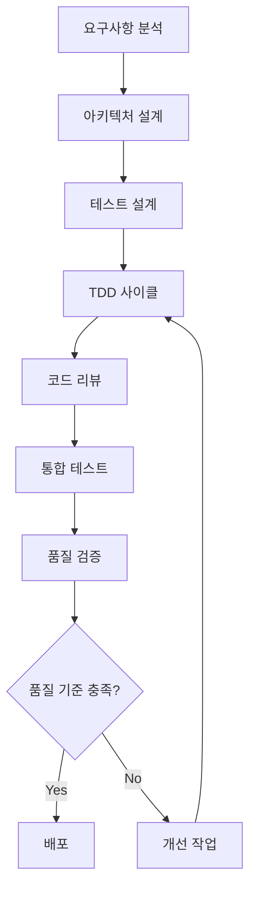

# 💻 개발 프로세스

> **TDD와 Clean Architecture 기반 개발 방법론**  
> AI와 함께하는 체계적이고 품질 중심의 개발 프로세스

## 🎯 개발 원칙

### 핵심 가치
1. **테스트 우선**: 모든 기능은 테스트부터 작성
2. **Clean Architecture**: 계층 분리와 의존성 역전 원칙
3. **지속적 개선**: 리팩토링과 코드 품질 향상
4. **문서화**: 모든 과정의 투명한 기록
5. **자동화**: 반복 작업의 자동화를 통한 효율성

### 품질 기준
- **코드 커버리지**: 80% 이상 유지
- **응답 시간**: 200ms 이하
- **에러율**: 1% 이하
- **경고***: 경고 10% 이하
- **코드 리뷰**: 모든 변경사항 필수

---

## 🔄 개발 워크플로우

### 전체 프로세스 개요


---

## 📋 1단계: 요구사항 분석

### 🎯 목적
기능 개발 전 명확한 요구사항 정의와 이해관계자 간 합의

### 📝 작업 내용
```
□ 기능 명세서 작성
  - 기능 목적과 범위 정의
  - 사용자 스토리 작성
  - 인수 조건 명시

□ 사용자 시나리오 정의
  - 주요 사용 경로 식별
  - 예외 상황 시나리오 정의
  - 성능 요구사항 명시

□ 이해관계자 검토
  - PM, 디자이너, 개발팀 검토
  - 기술적 제약사항 확인
  - 일정 및 우선순위 합의
```

### 📊 산출물
- [ ] 기능 명세서 (Function_Spec_[기능명].md)
- [ ] 사용자 스토리 목록
- [ ] 인수 조건 체크리스트
- [ ] 기술적 제약사항 문서

### ⏱️ 예상 소요 시간
- **간단한 기능**: 0.5일
- **일반적인 기능**: 1-2일
- **복잡한 기능**: 3-5일

---

## 🏗️ 2단계: 아키텍처 설계

### 🎯 목적
Clean Architecture 원칙에 따른 확장 가능하고 유지보수 가능한 구조 설계

### 📐 Clean Architecture 계층

```
┌─────────────────────────────────────┐
│         Presentation Layer          │ ← Controllers, UI Components
├─────────────────────────────────────┤
│         Application Layer           │ ← Use Cases, Services
├─────────────────────────────────────┤
│           Domain Layer              │ ← Entities, Business Rules
├─────────────────────────────────────┤
│        Infrastructure Layer         │ ← Database, External APIs
└─────────────────────────────────────┘
```

### 📝 작업 내용
```
□ 도메인 모델링
  - 핵심 엔티티 정의
  - 비즈니스 규칙 식별
  - 도메인 서비스 설계

□ 의존성 설계
  - 의존성 방향 정의 (외부 → 내부)
  - 인터페이스 추상화
  - DI 컨테이너 설정

□ API 설계
  - 엔드포인트 정의
  - 요청/응답 스키마 설계
  - 에러 핸들링 정의

□ 데이터베이스 설계
  - ERD 작성
  - 인덱스 전략 수립
  - 마이그레이션 계획
```

### 📊 산출물
- [ ] 아키텍처 다이어그램
- [ ] API 명세서 (OpenAPI/Swagger)
- [ ] 데이터베이스 ERD
- [ ] 의존성 주입 설정

### 🔍 검증 체크리스트
```
□ SOLID 원칙 준수
  - Single Responsibility: 각 클래스는 하나의 책임
  - Open/Closed: 확장에는 열려있고 수정에는 닫혀있음
  - Liskov Substitution: 상위 타입은 하위 타입으로 대체 가능
  - Interface Segregation: 클라이언트는 사용하지 않는 인터페이스에 의존하지 않음
  - Dependency Inversion: 고수준 모듈은 저수준 모듈에 의존하지 않음

□ 의존성 방향 검증
  - Domain ← Application ← Infrastructure
  - Domain ← Application ← Presentation
  - 순환 의존성 없음
```

---

## 🧪 3단계: 테스트 설계

### 🎯 목적
TDD를 위한 포괄적인 테스트 전략 수립

### 📋 테스트 레벨

#### 1. 유닛 테스트 (Unit Tests)
```
목적: 개별 함수/메서드의 정확성 검증

대상:
□ 도메인 엔티티 메서드
□ 비즈니스 로직 함수
□ 유틸리티 함수
□ Validator 클래스

커버리지 목표: 90% 이상
```

#### 2. 통합 테스트 (Integration Tests)
```
목적: 컴포넌트 간 상호작용 검증

대상:
□ API 엔드포인트
□ 데이터베이스 연동
□ 외부 서비스 연동
□ 이벤트 처리

커버리지 목표: 70% 이상
```

#### 3. E2E 테스트 (End-to-End Tests)
```
목적: 전체 사용자 시나리오 검증

대상:
□ 주요 사용자 플로우
□ 크리티컬 비즈니스 로직
□ 권한 체계
□ 에러 시나리오

커버리지 목표: 주요 시나리오 100%
```

### 📝 테스트 시나리오 작성
```
□ Happy Path 시나리오
  - 정상적인 입력과 예상 결과
  - 주요 사용 사례들
  - 성공 케이스들

□ Edge Case 시나리오  
  - 경계값 테스트
  - 빈 값, null 처리
  - 최대/최소값 테스트

□ Error Case 시나리오
  - 잘못된 입력 처리
  - 외부 의존성 실패
  - 권한 부족 상황
```

---

## 🔄 4단계: TDD 사이클

### 🎯 Red-Green-Refactor 원칙

#### 🔴 RED: 실패하는 테스트 작성
```
목적: 구현하고자 하는 기능의 명세를 테스트로 정의

체크리스트:
□ 하나의 기능에 집중한 테스트 작성
□ 테스트 실행 시 실패 확인
□ 명확하고 이해하기 쉬운 테스트명 사용
□ Given-When-Then 패턴 적용

예시:
describe('UserValidator', () => {
  it('should return false when email format is invalid', () => {
    // Given
    const invalidEmail = 'invalid-email';
    
    // When
    const result = UserValidator.isValidEmail(invalidEmail);
    
    // Then
    expect(result).toBe(false);
  });
});
```

#### 🟢 GREEN: 최소한의 코드로 테스트 통과
```
목적: 테스트를 통과시키는 최소한의 구현

원칙:
□ 테스트 통과가 최우선 목표
□ 과도한 설계나 최적화는 하지 않음
□ 가짜 구현(Fake Implementation)도 허용
□ 모든 테스트가 통과하는지 확인

예시:
class UserValidator {
  static isValidEmail(email: string): boolean {
    return email.includes('@'); // 최소한의 구현
  }
}
```

#### 🔵 REFACTOR: 코드 품질 개선
```
목적: 기능 변경 없이 코드 구조와 품질 향상

체크리스트:
□ 중복 코드 제거
□ 변수/함수명 개선
□ 복잡한 조건문 단순화
□ 적절한 디자인 패턴 적용
□ 테스트 통과 유지 확인

예시:
class UserValidator {
  private static readonly EMAIL_REGEX = /^[^\s@]+@[^\s@]+\.[^\s@]+$/;
  
  static isValidEmail(email: string): boolean {
    return this.EMAIL_REGEX.test(email);
  }
}
```

### 🔄 TDD 사이클 반복
```
1. RED → GREEN → REFACTOR
2. 다음 테스트 케이스로 이동
3. 모든 테스트 케이스 완료까지 반복
4. 전체 테스트 스위트 실행 및 검증
```

---

## 👥 5단계: 코드 리뷰

### 🎯 목적
코드 품질 향상 및 지식 공유

### 📋 리뷰 체크리스트

#### 기능적 검토
```
□ 요구사항 완전 구현
□ 비즈니스 로직 정확성
□ 예외 상황 처리
□ 성능 영향 검토
```

#### 코드 품질 검토
```
□ Clean Code 원칙 준수
□ SOLID 원칙 적용
□ 적절한 디자인 패턴 사용
□ 코드 중복 최소화
```

#### 테스트 검토
```
□ 테스트 커버리지 80% 이상
□ 의미있는 테스트 케이스
□ 테스트 코드 가독성
□ 모든 테스트 통과
```

#### 보안 검토
```
□ 입력 데이터 검증
□ SQL 인젝션 방지
□ XSS 방지
□ 인증/인가 처리
```

### 🔍 리뷰 프로세스
```
1. Pull Request 생성
2. 자동 CI 검사 통과 확인
3. 코드 리뷰어 지정
4. 리뷰 진행 및 피드백
5. 수정사항 반영
6. 최종 승인 및 머지
```

---

## 🧪 6단계: 통합 테스트

### 🎯 목적
개별 컴포넌트들이 함께 작동하는지 검증

### 📋 테스트 범위
```
□ API 엔드포인트 테스트
  - 요청/응답 검증
  - 상태 코드 확인
  - 에러 처리 검증

□ 데이터베이스 연동 테스트
  - CRUD 작업 검증
  - 트랜잭션 처리
  - 데이터 무결성

□ 외부 서비스 연동 테스트
  - API 호출 성공/실패
  - 타임아웃 처리
  - 재시도 로직

□ 이벤트 시스템 테스트
  - 이벤트 발행/구독
  - 비동기 처리
  - 메시지 큐 동작
```

### 🛠️ 테스트 환경
```
□ 테스트 데이터베이스 사용
□ Mock 서버 구성
□ 격리된 테스트 환경
□ 자동화된 테스트 실행
```

---

## ✅ 7단계: 품질 검증

### 📊 자동 검증 항목
```
□ 코드 커버리지
  - 유닛 테스트: 90% 이상
  - 통합 테스트: 70% 이상
  - 전체: 80% 이상

□ 정적 분석
  - ESLint/TSLint 규칙 통과
  - SonarQube 품질 게이트 통과
  - 보안 취약점 스캔 통과

□ 성능 테스트
  - 응답 시간 200ms 이하
  - 메모리 사용량 적정 수준
  - CPU 사용률 70% 이하
```

### 🔍 수동 검증 항목
```
□ 사용자 시나리오 테스트
□ 접근성 테스트
□ 크로스 브라우저 테스트
□ 모바일 호환성 테스트
```

---

## 🚀 8단계: 배포

### 📋 배포 전 체크리스트
```
□ 모든 테스트 통과
□ 코드 리뷰 완료
□ 품질 기준 충족
□ 문서 업데이트
□ 릴리즈 노트 작성
```

### 🔄 배포 전략
```
□ Blue-Green 배포
  - 무중단 배포
  - 빠른 롤백 가능
  - 프로덕션 검증

□ Canary 배포
  - 점진적 트래픽 증가
  - 실시간 모니터링
  - 위험 최소화
```

---

## 🔧 개발 도구 및 환경

### 필수 도구 (예시)
```
□ IDE/Editor
  - VSCode, IntelliJ IDEA
  - 코드 포맷팅 설정
  - 플러그인 설치

□ 버전 관리
  - Git 워크플로우
  - 브랜치 전략 (Git Flow)
  - 커밋 메시지 규칙

□ 테스트 도구
  - Jest (JavaScript/TypeScript)
  - PyTest (Python)
  - Postman (API 테스트)

□ 빌드 도구
  - Webpack, Vite
  - Docker
  - CI/CD 파이프라인
```

---

## 💡 참고 자료

### 관련 문서
- [기능_문서.md](../기능_문서.md)
- [review/quality-checklist.md](../review/quality-checklist.md)
- [guides/development-guide.md](../guides/development-guide.md)

### 외부 참조
- [Clean Architecture by Robert Martin](https://blog.cleancoder.com/uncle-bob/2012/08/13/the-clean-architecture.html)
- [Test Driven Development](https://www.agilealliance.org/glossary/tdd/)
- [SOLID Principles](https://www.digitalocean.com/community/conceptual_articles/s-o-l-i-d-the-first-five-principles-of-object-oriented-design) 