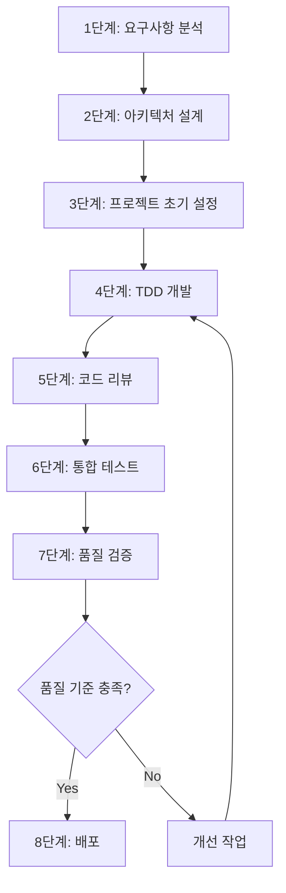

# 💻 개발 프로세스

> **TDD와 Clean Architecture 기반 개발 방법론**  
> 체계적이고 품질 중심의 개발 프로세스

## ⚠️ 중요 주의사항

### 프로세스 준수 사항
1. **단계별 순차 진행**
   - 1-2단계는 반드시 문서 작성에만 집중
   - 3단계에서 프로젝트 생성까지만 수행
   - 4단계부터 실제 개발 시작

2. **TDD 원칙 준수**
   - RED: 실패하는 테스트 먼저 작성
   - GREEN: 최소한의 코드로 테스트 통과
   - REFACTOR: 코드 개선
   - 각 단계별 증거 문서화 필수

3. **품질 검증 필수**
   - 코드 리뷰 체크리스트 완전 준수
   - 모든 테스트 통과 확인
   - 품질 메트릭스 달성 여부 검증

4. **배포 전 필수 사항**
   - 릴리즈 노트 작성
   - 배포 프로세스 문서화
   - 롤백 계획 수립

## 🔄 개발 워크플로우

### 전체 프로세스 개요


## 📋 1단계: 요구사항 분석

### ⚠️ 주의사항
- 이 단계에서는 문서 작성만 수행
- 코드 작성 금지

### 📝 필수 산출물
- [ ] 기능 명세서
- [ ] 사용자 스토리
- [ ] 인수 조건
- [ ] 기술적 제약사항 문서

## 🏗️ 2단계: 아키텍처 설계

### ⚠️ 주의사항
- 이 단계에서도 문서 작성만 수행
- 코드 작성 금지

### 📝 필수 산출물
- [ ] 아키텍처 다이어그램
- [ ] 기술 스택 선정 문서
- [ ] 의존성 설계 문서
- [ ] ADR (Architecture Decision Records)

## 🛠️ 3단계: 프로젝트 초기 설정 (C#)

### ⚠️ 주의사항
- 프로젝트 생성까지만 수행
- 비즈니스 로직 구현 금지
- 불필요한 템플릿 파일 제거 필수
- 솔루션 파일의 프로젝트 참조 확인 필수

### 📝 필수 산출물
- [ ] 프로젝트 구조
- [ ] 기본 설정 파일
- [ ] 의존성 정의
- [ ] 빌드 스크립트

### 🔍 프로젝트 구조 검증
```bash
# 1. 솔루션 생성
dotnet new sln -n [ProjectName]

# 2. 프로젝트 생성
dotnet new classlib -n [ProjectName].Domain
dotnet new classlib -n [ProjectName].Application
dotnet new classlib -n [ProjectName].Infrastructure
dotnet new webapi -n [ProjectName].Web
dotnet new xunit -n [ProjectName].Tests

# 3. 솔루션에 프로젝트 추가
dotnet sln add [ProjectName].Domain/[ProjectName].Domain.csproj
dotnet sln add [ProjectName].Application/[ProjectName].Application.csproj
dotnet sln add [ProjectName].Infrastructure/[ProjectName].Infrastructure.csproj
dotnet sln add [ProjectName].Web/[ProjectName].Web.csproj
dotnet sln add [ProjectName].Tests/[ProjectName].Tests.csproj

# 4. 프로젝트 참조 설정
dotnet add [ProjectName].Application reference [ProjectName].Domain
dotnet add [ProjectName].Infrastructure reference [ProjectName].Application
dotnet add [ProjectName].Web reference [ProjectName].Infrastructure
dotnet add [ProjectName].Tests reference [ProjectName].Domain [ProjectName].Application [ProjectName].Infrastructure
```

### ✅ 초기 설정 체크리스트
1. 프로젝트 구조 검증
   ```
   솔루션/
   ├── [ProjectName].Domain/          # 도메인 모델, 인터페이스
   │   ├── Models/
   │   └── Interfaces/
   ├── [ProjectName].Application/     # 비즈니스 로직
   │   ├── Services/
   │   └── DTOs/
   ├── [ProjectName].Infrastructure/  # 외부 시스템 연동
   │   ├── Persistence/
   │   └── External/
   ├── [ProjectName].Web/            # API 엔드포인트
   │   ├── Controllers/
   │   └── Middleware/
   └── [ProjectName].Tests/          # 테스트 프로젝트
       ├── Unit/
       ├── Integration/
       └── E2E/
   ```

2. 불필요한 파일 제거
   - [ ] Class1.cs 파일 제거
   - [ ] WeatherForecast.cs 파일 제거
   - [ ] 기본 Controller 파일 제거

3. 기본 설정 파일 검증
   - [ ] .gitignore 구성
   - [ ] .editorconfig 설정
   - [ ] Directory.Build.props 구성
   - [ ] global.json 버전 확인

4. 프로젝트 참조 검증
   ```bash
   dotnet sln list  # 모든 프로젝트가 솔루션에 포함되어 있는지 확인
   ```

## 개발 전 📋 코딩 표준 준수 참고

### ⚠️ 필수 준수사항
1. **속성 초기화**
   ```csharp
   // ✅ 필수: 모든 속성 명시적 초기화
   public string FileName { get; set; } = string.Empty;
   ```

2. **네임스페이스 선언**
   ```csharp
   // ✅ 필수: 한 줄로 선언
   namespace SMFFileWatcher.Domain.Models;
   ```

3. **상세 규칙**
   - [코딩 표준 문서](./coding-standards.md) 참조
   - 빌드 전 체크리스트 검증 필수

### 📝 검증 절차
1. 코드 작성 완료 후
   ```powershell
   # 전체 솔루션 빌드 및 경고 검증
   dotnet build /warnaserror
   ```

2. 코드 리뷰 시
   - 코딩 표준 준수 여부 확인
   - 초기화되지 않은 속성 확인
   - 네임스페이스 선언 방식 확인

## 개발 전 📦 C# 패키지 관리 참고

### ⚠️ 주의사항
1. **패키지 선택 시 ADR 필수**
   - 새로운 패키지 추가 전 ADR 작성
   - 패키지 버전 명시
   - 선택 이유 및 대안 분석 포함

2. **패키지 버전 관리**
   - Directory.Build.props에 버전 중앙화
   - 호환성 검증 필수
   - 보안 취약점 확인

### 📝 패키지 추가 절차
1. ADR 작성
   ```markdown
   # ADR XXX: [패키지명] 선택
   ## 상태
   승인 대기
   ## 컨텍스트
   [필요성 설명]
   ## 결정사항
   - 패키지: [패키지명]
   - 버전: [X.Y.Z]
   - 목적: [사용 목적]
   ```

2. 패키지 추가
   ```powershell
   # 패키지 추가
   dotnet add package [패키지명] -v [버전]
   
   # 빌드 검증
   dotnet build
   ```

3. 문서화
   - ADR 업데이트
   - 관련 문서 수정

## 🔄 4단계: TDD 개발

### ⚠️ TDD 사이클 준수
각 기능에 대해 반드시 다음 순서 준수:

1. **RED 단계**
   ```csharp
   [Fact]
   public void Test_Should_Fail()
   {
       // 1. 실패하는 테스트 작성
       // 2. 실행하여 실패 확인
       // 3. 실패 내용 문서화
   }
   ```

2. **GREEN 단계**
   ```csharp
   public class Implementation
   {
       // 1. 최소한의 코드만 작성
       // 2. 테스트 통과 확인
       // 3. 통과 증거 문서화
   }
   ```

3. **REFACTOR 단계**
   ```csharp
   public class RefinedImplementation
   {
       // 1. 코드 개선
       // 2. 테스트 유지 확인
       // 3. 개선 내용 문서화
   }
   ```

### 📝 필수 산출물
- [ ] 테스트 코드
- [ ] RED-GREEN-REFACTOR 증거 문서
- [ ] 리팩토링 이력


## 👥 5단계: 코드 리뷰

### ⚠️ 주의사항
- 체크리스트 항목 100% 준수
- 리뷰 증거 보관 필수

### 📝 필수 산출물
- [ ] 코드 리뷰 체크리스트 결과
- [ ] 리뷰어 의견 및 조치 내용
- [ ] 리뷰 완료 승인 문서

## 🧪 6단계: 통합 테스트

### ⚠️ 주의사항
- 모든 시나리오 테스트 필수
- 실제 환경 검증 필수

### 📝 필수 산출물
- [ ] 통합 테스트 결과 보고서
- [ ] 성능 테스트 결과
- [ ] 환경별 검증 결과

## ✅ 7단계: 품질 검증

### ⚠️ 주의사항
- 모든 품질 기준 충족 필수
- 예외 없는 기준 준수

### 📝 필수 산출물
- [ ] 품질 메트릭스 보고서
- [ ] 정적 분석 결과
- [ ] 보안 검증 결과

## 🚀 8단계: 배포

### ⚠️ 주의사항
- 릴리즈 노트 필수 작성
- 배포 절차 문서화 필수
- 롤백 계획 필수

### 📝 필수 산출물
- [ ] 릴리즈 노트
- [ ] 배포 프로세스 문서
- [ ] 롤백 계획
- [ ] 운영 가이드

## 📋 단계별 완료 조건

### 각 단계 완료를 위한 필수 조건
1. 모든 필수 산출물 완료
2. 품질 기준 충족