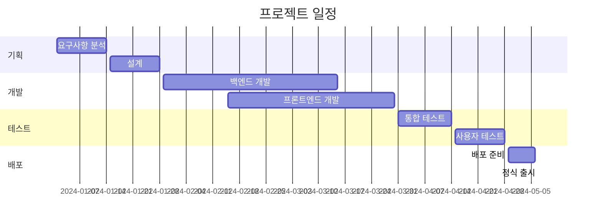

# 🚀 프로젝트 소개

> **프로젝트 개요 및 목표**  
> 프로젝트의 비전, 목표, 범위를 명확히 정의

## 📋 프로젝트 기본 정보

| 항목 | 내용 |
|------|------|
| **프로젝트명** | [프로젝트명을 입력하세요] |
| **프로젝트 코드** | [PROJECT_CODE] |
| **시작일** | [YYYY-MM-DD] |
| **예상 완료일** | [YYYY-MM-DD] |
| **현재 상태** | [기획/설계/개발/테스트/배포/완료] |
| **프로젝트 관리자** | [PM명] |
| **기술 리더** | [TL명] |

## 🎯 프로젝트 개요

### 비전 (Vision)
[프로젝트가 지향하는 궁극적인 목표와 미래상]

### 미션 (Mission)
[프로젝트를 통해 달성하고자 하는 구체적인 임무]

### 핵심 가치 (Core Values)
- **가치 1**: [설명]
- **가치 2**: [설명]
- **가치 3**: [설명]

## 📊 현황 분석

### 배경
[프로젝트가 시작된 배경과 필요성]

### 현재 문제점
1. **문제 1**: [현재 상황의 문제점]
2. **문제 2**: [해결이 필요한 이슈]
3. **문제 3**: [개선이 필요한 영역]

### 기회 요소
- **기회 1**: [시장 기회나 기술적 기회]
- **기회 2**: [비즈니스 기회]
- **기회 3**: [경쟁 우위 요소]

## 🎯 프로젝트 목표

### 📈 비즈니스 목표
- [ ] **목표 1**: [구체적이고 측정 가능한 비즈니스 목표]
- [ ] **목표 2**: [예: 매출 20% 증대]
- [ ] **목표 3**: [예: 고객 만족도 90% 달성]

### 🔧 기술적 목표
- [ ] **목표 1**: [기술적 성취 목표]
- [ ] **목표 2**: [예: 시스템 성능 50% 향상]
- [ ] **목표 3**: [예: 장애 시간 99% 감소]

### 👥 팀 목표
- [ ] **목표 1**: [팀 역량 강화 목표]
- [ ] **목표 2**: [예: 개발 프로세스 자동화]
- [ ] **목표 3**: [예: 코드 품질 기준 달성]

## 📋 프로젝트 범위

### ✅ 포함 사항 (In Scope)
- [ ] [프로젝트에 포함되는 기능/영역 1]
- [ ] [프로젝트에 포함되는 기능/영역 2]
- [ ] [프로젝트에 포함되는 기능/영역 3]

### ❌ 제외 사항 (Out of Scope)
- [ ] [프로젝트 범위에서 제외되는 기능/영역 1]
- [ ] [프로젝트 범위에서 제외되는 기능/영역 2]
- [ ] [프로젝트 범위에서 제외되는 기능/영역 3]

### 🔄 향후 고려사항 (Future Scope)
- [ ] [향후 단계에서 고려할 기능/영역 1]
- [ ] [향후 단계에서 고려할 기능/영역 2]
- [ ] [향후 단계에서 고려할 기능/영역 3]

## 👥 이해관계자 (Stakeholders)

### 🎯 주요 이해관계자

| 역할 | 이름 | 소속 | 연락처 | 책임 |
|------|------|------|--------|------|
| **스폰서** | [이름] | [부서] | [연락처] | 프로젝트 승인 및 예산 |
| **프로젝트 관리자** | [이름] | [부서] | [연락처] | 전체 프로젝트 관리 |
| **기술 리더** | [이름] | [부서] | [연락처] | 기술적 의사결정 |
| **비즈니스 분석가** | [이름] | [부서] | [연락처] | 요구사항 분석 |

### 👤 사용자 그룹
- **1차 사용자**: [주요 사용자 그룹과 특성]
- **2차 사용자**: [보조 사용자 그룹과 특성]
- **관리자**: [시스템 관리자 그룹과 특성]

## 🏗️ 기술 스택

### 프론트엔드
- **언어**: [JavaScript/TypeScript]
- **프레임워크**: [React/Vue/Angular]
- **UI 라이브러리**: [Material-UI/Ant Design]
- **상태 관리**: [Redux/Vuex/Zustand]

### 백엔드
- **언어**: [Java/Python/Node.js]
- **프레임워크**: [Spring/Django/Express]
- **데이터베이스**: [PostgreSQL/MySQL/MongoDB]
- **캐시**: [Redis/Memcached]

### 인프라
- **클라우드**: [AWS/Azure/GCP]
- **컨테이너**: [Docker/Kubernetes]
- **CI/CD**: [Jenkins/GitHub Actions/GitLab CI]
- **모니터링**: [Prometheus/Grafana]

## 📅 일정 및 마일스톤

### 주요 마일스톤

| 단계 | 마일스톤 | 예정일 | 상태 | 비고 |
|------|----------|--------|------|------|
| **1단계** | 요구사항 확정 | [YYYY-MM-DD] | [완료/진행중/예정] | |
| **2단계** | 아키텍처 설계 | [YYYY-MM-DD] | [완료/진행중/예정] | |
| **3단계** | MVP 개발 완료 | [YYYY-MM-DD] | [완료/진행중/예정] | |
| **4단계** | 베타 테스트 | [YYYY-MM-DD] | [완료/진행중/예정] | |
| **5단계** | 정식 출시 | [YYYY-MM-DD] | [완료/진행중/예정] | |

### 세부 일정

## 💰 예산 및 자원

### 예산 계획

| 항목 | 예산 | 비고 |
|------|------|------|
| **인력비** | [금액] | 개발팀, PM 등 |
| **시스템비** | [금액] | 클라우드, 라이선스 등 |
| **도구비** | [금액] | 개발도구, 모니터링 등 |
| **기타** | [금액] | 교육, 컨설팅 등 |
| **총합** | [금액] | |

### 인력 계획

| 역할 | 인원 | 기간 | 스킬 요구사항 |
|------|------|------|---------------|
| **풀스택 개발자** | [X]명 | [X]개월 | React, Node.js, DB |
| **프론트엔드 개발자** | [X]명 | [X]개월 | React, TypeScript |
| **백엔드 개발자** | [X]명 | [X]개월 | Java, Spring, DB |
| **DevOps 엔지니어** | [X]명 | [X]개월 | AWS, Docker, K8s |

## 📊 성공 지표 (KPI)

### 📈 정량적 지표
- **사용자 수**: [목표 사용자 수]
- **응답 시간**: [목표 응답 시간]
- **가용성**: [목표 가용성 %]
- **성능**: [목표 TPS]

### 📋 정성적 지표
- **사용자 만족도**: [목표 만족도]
- **코드 품질**: [목표 품질 지표]
- **팀 만족도**: [목표 팀 만족도]

## ⚠️ 위험 요소 및 대응 방안

### 🚨 주요 위험 요소

| 위험 요소 | 발생 확률 | 영향도 | 대응 방안 | 담당자 |
|-----------|-----------|--------|-----------|--------|
| **기술적 위험** | [High/Medium/Low] | [High/Medium/Low] | [대응 방안] | [담당자] |
| **일정 지연** | [High/Medium/Low] | [High/Medium/Low] | [대응 방안] | [담당자] |
| **자원 부족** | [High/Medium/Low] | [High/Medium/Low] | [대응 방안] | [담당자] |

### 🛡️ 위험 완화 전략
1. **정기적 위험 점검**: 매주 위험 요소 검토
2. **대안 계획 수립**: 주요 위험에 대한 Plan B 준비
3. **조기 경보 시스템**: 위험 징후 조기 감지

## 🔄 변경 관리

### 변경 요청 프로세스
1. **변경 요청서 작성**
2. **영향도 분석**
3. **승인 위원회 검토**
4. **승인/반려 결정**
5. **변경 사항 적용**

### 변경 승인 기준
- **범위 변경**: 프로젝트 스폰서 승인 필요
- **일정 변경**: PM과 기술 리더 승인 필요
- **예산 변경**: 재무 담당자 승인 필요

## 📞 의사소통 계획

### 정기 미팅
- **일일 스탠드업**: 매일 오전 9시 (15분)
- **주간 진행 보고**: 매주 금요일 (30분)
- **월간 이해관계자 보고**: 매월 마지막 주 (60분)

### 보고 체계
- **주간 리포트**: 진행 상황, 이슈, 다음 주 계획
- **월간 리포트**: 전체 진행률, KPI 달성도, 위험 요소
- **마일스톤 리포트**: 주요 단계 완료 시 상세 보고

## 📋 품질 관리

### 품질 목표
- **코드 커버리지**: 80% 이상
- **버그 밀도**: 1000라인당 1개 이하
- **성능**: 응답시간 200ms 이하
- **사용성**: 사용자 만족도 90% 이상

### 품질 보증 활동
- [ ] 코드 리뷰 의무화
- [ ] 자동화된 테스트 수행
- [ ] 정기적인 품질 감사
- [ ] 사용자 피드백 수집

## 📚 지식 관리

### 문서화 계획
- [ ] 기술 문서 작성 및 유지
- [ ] 사용자 매뉴얼 제작
- [ ] 운영 가이드 작성
- [ ] 교육 자료 개발

### 지식 공유
- [ ] 기술 세미나 개최
- [ ] 코드 리뷰 세션
- [ ] 베스트 프랙티스 공유
- [ ] 레슨런 정리

---

## 💡 참고 사항

### 관련 문서
- [기능_문서.md](./기능_문서.md)
- [development/development-process.md](./development/development-process.md)
- [guides/development-guide.md](./guides/development-guide.md)

### 외부 참조
- [회사 표준 프로세스]
- [산업 표준 가이드라인]
- [관련 프로젝트 사례] 